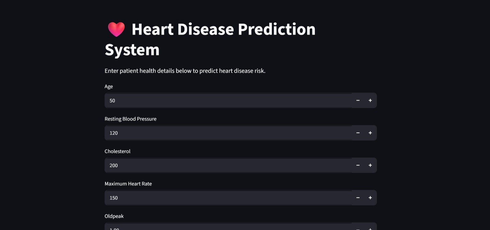
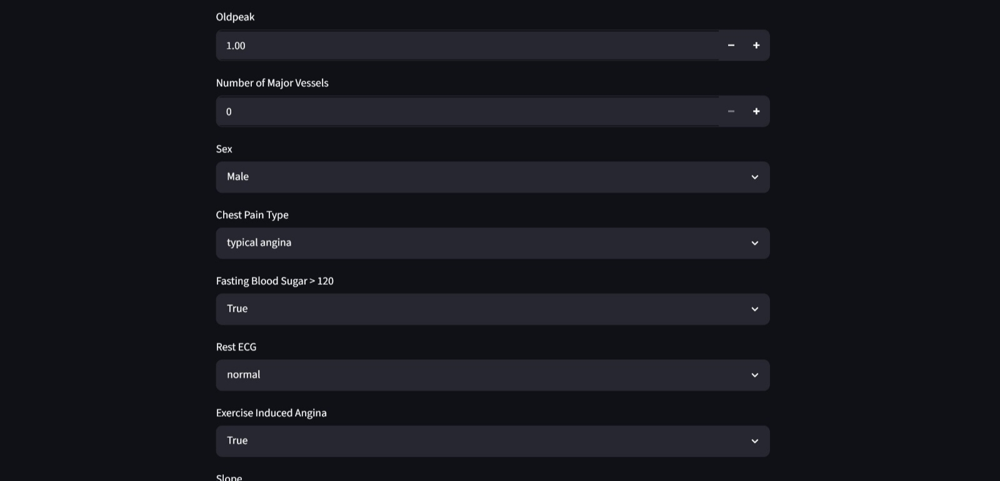
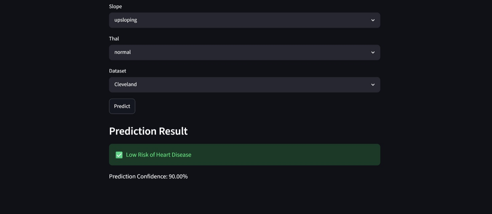

# ❤️ Heart Disease Prediction System

## 📌 Project Overview

This project is a Machine Learning-based Heart Disease Prediction System developed using Python, Scikit-learn, and Streamlit.

The application predicts the likelihood of heart disease based on patient health parameters using Machine Learning algorithms and an interactive web interface.

This project includes:

* Data preprocessing
* Exploratory Data Analysis (EDA)
* Feature engineering
* Machine Learning model training
* Model evaluation
* Real-time prediction system
* Interactive Streamlit web application

---

# 🌐 Live Demo

### 🚀 Live Application

[Click Here to Open Live App](https://disease-prediction-system-jpqeqltnvtc9rcmkvyau5n.streamlit.app/)

---

### 💻 GitHub Repository

[Click Here to View Repository](https://github.com/kanikagupta18silver-spec/Disease-Prediction-System)

---

# 🚀 Features

* Heart disease prediction using Machine Learning
* Interactive Streamlit web application
* Multiple ML model comparison
* Real-time prediction system
* Data preprocessing and cleaning
* Feature engineering
* Confusion matrix visualization
* Feature importance analysis
* Model persistence using Joblib

---

# 🛠️ Tech Stack

* Python
* Pandas
* NumPy
* Matplotlib
* Seaborn
* Scikit-learn
* Streamlit
* Joblib

---

# 📂 Project Structure

bash
Disease-Prediction-System/
│
├── app/
│
├── data/
│   └── heart_disease_uci.csv
│
├── models/
│   ├── heart_model.pkl
│   ├── heart_rf_model.pkl
│   ├── scaler.pkl
│   └── training_columns.pkl
│
├── notebooks/
│
├── screenshots/
│   ├── Homepage.png
│   ├── input_form.png
│   └── Prediction_result.png
│
├── src/
│
├── venv/
│
├── .gitignore
├── app.py
├── main.py
├── README.md
└── requirements.txt

---

# 📊 Machine Learning Models Used

## 1️⃣ Logistic Regression

Used as a baseline classification model for heart disease prediction.

---

## 2️⃣ Random Forest Classifier

Used for improved prediction performance and feature importance analysis.

---

# 📈 Model Evaluation Techniques

The models were evaluated using:

* Accuracy Score
* Classification Report
* Confusion Matrix
* Feature Importance Analysis

---

# ▶️ How to Run the Project

## 1️⃣ Clone Repository

bash
git clone YOUR_GITHUB_REPOSITORY_LINK

---

## 2️⃣ Navigate to Project Folder

bash
cd Disease-Prediction-System

---

## 3️⃣ Install Dependencies

bash
pip install -r requirements.txt

---

## 4️⃣ Run Machine Learning Pipeline

bash
python main.py

---

## 5️⃣ Run Streamlit Application

bash
streamlit run app.py

---

# 📸 Screenshots

## 🏠 Homepage

---

## 📝 Input Form

---

## ❤️ Prediction Result

---

# 💻 Web Application Features

The Streamlit application allows users to:

* Enter patient health details
* Predict heart disease risk
* View prediction confidence score
* Experience real-time Machine Learning prediction

---

# 🔍 Dataset Information

Dataset used:

* Heart Disease UCI Dataset
* Source: Kaggle

The dataset contains various medical attributes such as:

* Age
* Cholesterol
* Blood Pressure
* Chest Pain Type
* Heart Rate
* Thalassemia
* ECG Results

---

# 🔮 Future Improvements

* Multiple disease prediction system
* Deep learning integration
* Database connectivity
* Authentication system
* Cloud deployment
* Improved UI/UX
* API integration
* Docker support

---

# 👩‍💻 Author

Kanika Gupta

---

# ⭐ Support

If you found this project useful, consider giving it a ⭐ on GitHub.